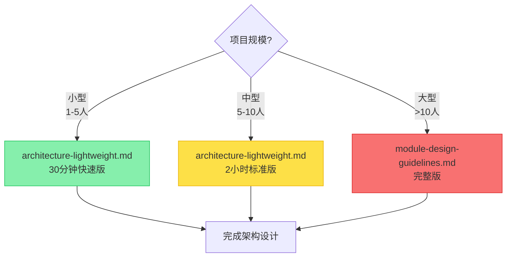
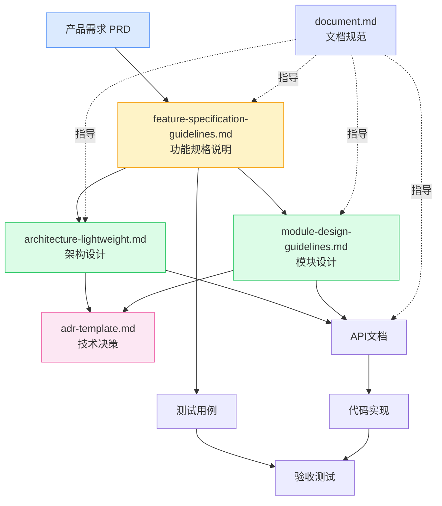

# Docs 目录文档索引

> 本目录包含项目文档相关的模板、规范和指南

最近更新: 2025-10-11

---

## 📚 文档分类

### 核心规范（所有项目必读）
| 文档 | 说明 | 适用项目 | 优先级 |
|------|------|----------|--------|
| [adr-template.md](./adr-template.md) | 架构决策记录模板 | 所有项目 | P0 |
| [document.md](./document.md) | 文档体系与模板规范 | 所有项目 | P0 |
| [lessons-learned-code-analysis.md](./lessons-learned-code-analysis.md) | 代码分析经验教训案例集 | 所有项目 | P1 |

### 架构设计规范
| 文档 | 说明 | 适用项目 | 优先级 |
|------|------|----------|--------|
| [architecture-lightweight.md](./architecture-lightweight.md) | 轻量级架构文档模板 | 中小型项目（≤10人） | P1 |
| [module-design-guidelines.md](./module-design-guidelines.md) | 完整模块设计规范 | 大型项目（>10人） | P2 |

### 需求与设计
| 文档 | 说明 | 适用项目 | 优先级 |
|------|------|----------|--------|
| [feature-specification-guidelines.md](./feature-specification-guidelines.md) | 功能规格说明指南 | 中大型项目 | P1 |

---

## 🎯 快速选择指南

### 按项目规模选择

#### 小型项目（1-5人，< 3个月）
**必读**：
- ✅ [document.md](./document.md) - 了解文档体系
- ✅ [architecture-lightweight.md](./architecture-lightweight.md) - 30分钟快速版

**可选**：
- 📖 [adr-template.md](./adr-template.md) - 重要技术决策时使用

#### 中型项目（5-10人，3-6个月）
**必读**：
- ✅ [document.md](./document.md)
- ✅ [architecture-lightweight.md](./architecture-lightweight.md) - 2小时标准版
- ✅ [adr-template.md](./adr-template.md)

**推荐**：
- 📖 [feature-specification-guidelines.md](./feature-specification-guidelines.md) - 复杂功能开发

#### 大型项目（>10人，> 6个月）
**必读**：
- ✅ 所有文档

**重点**：
- 🔥 [module-design-guidelines.md](./module-design-guidelines.md)
- 🔥 [feature-specification-guidelines.md](./feature-specification-guidelines.md)
- 🔥 [adr-template.md](./adr-template.md)

---

## 📖 按文档类型选择

### 架构设计

### 需求文档
- **简单功能**: 使用用户故事（User Story）即可
- **中等复杂度**: [feature-specification-guidelines.md](./feature-specification-guidelines.md) 简化版
- **高复杂度**: [feature-specification-guidelines.md](./feature-specification-guidelines.md) 完整版

### 决策记录
- **技术选型**: [adr-template.md](./adr-template.md)
- **架构变更**: [adr-template.md](./adr-template.md)
- **重要决策**: [adr-template.md](./adr-template.md)

---

## 🔗 文档关系图

---

## ✨ 文档特色

### adr-template.md
- ✅ 完整的ADR模板（基础版 + 简化版）
- ✅ 实际案例示例
- ✅ 团队协作流程
- ✅ 质量检查清单

### architecture-lightweight.md
- ✅ 3种填写模式（30分钟/2小时/1天）
- ✅ 10章节完整模板
- ✅ 丰富的Mermaid图表示例
- ✅ 实用的检查清单

### document.md
- ✅ 覆盖所有文档类型（README/API/CHANGELOG等）
- ✅ 可直接复制的完整模板
- ✅ 多语言代码示例
- ✅ 文档质量保证体系

### feature-specification-guidelines.md
- ✅ 从需求到验收的完整流程
- ✅ 用户注册功能完整示例
- ✅ 接口设计详细规范
- ✅ 监控运维指南

### module-design-guidelines.md
- ✅ 大型项目模块设计规范
- ✅ 七要素设计方法
- ✅ 流程与状态机设计
- ✅ NFR与风险管理

---

## 📝 使用建议

### 文档编写顺序
1. **项目启动**: 先读 [document.md](./document.md)，了解文档体系
2. **架构设计**: 使用 [architecture-lightweight.md](./architecture-lightweight.md)
3. **技术决策**: 使用 [adr-template.md](./adr-template.md) 记录重要决策
4. **功能开发**: 使用 [feature-specification-guidelines.md](./feature-specification-guidelines.md)
5. **大型模块**: 使用 [module-design-guidelines.md](./module-design-guidelines.md)

### 文档维护
- **定期更新**: 每季度回顾一次
- **版本管理**: 记录变更历史
- **团队评审**: 重要文档需要评审
- **持续改进**: 根据反馈优化

---

## 🎓 学习路径

### 新手路径（第1周）
1. 📖 [document.md](./document.md) - 30分钟了解文档体系
2. 📖 [architecture-lightweight.md](./architecture-lightweight.md) - 30分钟快速版
3. ✍️ 实践：为小项目编写架构文档

### 进阶路径（第1个月）
1. 📖 [adr-template.md](./adr-template.md) - 了解决策记录
2. 📖 [feature-specification-guidelines.md](./feature-specification-guidelines.md) - 学习功能设计
3. ✍️ 实践：为中型项目编写完整文档

### 高级路径（持续）
1. 📖 [module-design-guidelines.md](./module-design-guidelines.md) - 大型项目设计
2. 📖 参与团队文档评审
3. ✍️ 优化和完善文档规范

---

## 🛠️ 工具推荐

### 文档编辑
- **VSCode**: Markdown + Mermaid 插件
- **Typora**: 所见即所得编辑器
- **Notion**: 团队协作文档

### 图表工具
- **Mermaid**: 代码生成图表
- **Draw.io**: 在线流程图
- **PlantUML**: UML 图表

### 版本管理
- **Git**: 文档版本控制
- **GitBook**: 在线文档发布
- **Docusaurus**: 文档站点生成

---

## 📞 反馈与贡献

### 问题反馈
如果您发现文档问题或有改进建议，请：
1. 提交 Issue
2. 发起 Pull Request
3. 联系文档维护者

### 贡献指南
欢迎贡献！请遵循以下规范：
1. 遵循现有文档格式
2. 提供实际案例
3. 补充图表说明
4. 通过评审后合并

---

## 📊 文档统计

| 文档 | 大小 | 最后更新 | 状态 |
|------|------|----------|------|
| adr-template.md | ~400行 | 2025-10-11 | ✅ 完成 |
| architecture-lightweight.md | ~850行 | 2025-10-11 | ✅ 完成 |
| document.md | ~900行 | 2025-10-11 | ✅ 完成 |
| feature-specification-guidelines.md | ~3800行 | 2025-10-11 | ✅ 完成 |
| module-design-guidelines.md | ~528行 | 2025-09-18 | ✅ 良好 |
| lessons-learned-code-analysis.md | ~350行 | 2026-01-06 | ✅ 完成 |

**总计**: 约6800+行文档内容（不含已移至tools目录的代码分析规范）

---

## 🔄 更新日志

### 2026-01-06
- ✅ 新增 lessons-learned-code-analysis.md（代码分析经验教训案例集）
- ✅ 更新 code-analysis.md 第6节（问题分析与修复验证）
- ✅ 更新 must.md 第6节（问题分析与修复原则）

### 2025-10-11
- ✅ 完全重写 adr-template.md
- ✅ 完全重写 architecture-lightweight.md
- ✅ 完全重写 document.md
- ✅ 完全重写 feature-specification-guidelines.md
- ✅ 新增 README.md 索引文档

### 历史版本
- 2025-09-18: 初始版本
- 2025-10-10: 路径修正

---

**维护者**: 技术团队  
**联系方式**: 见项目 README  
**最后更新**: 2026-01-06

