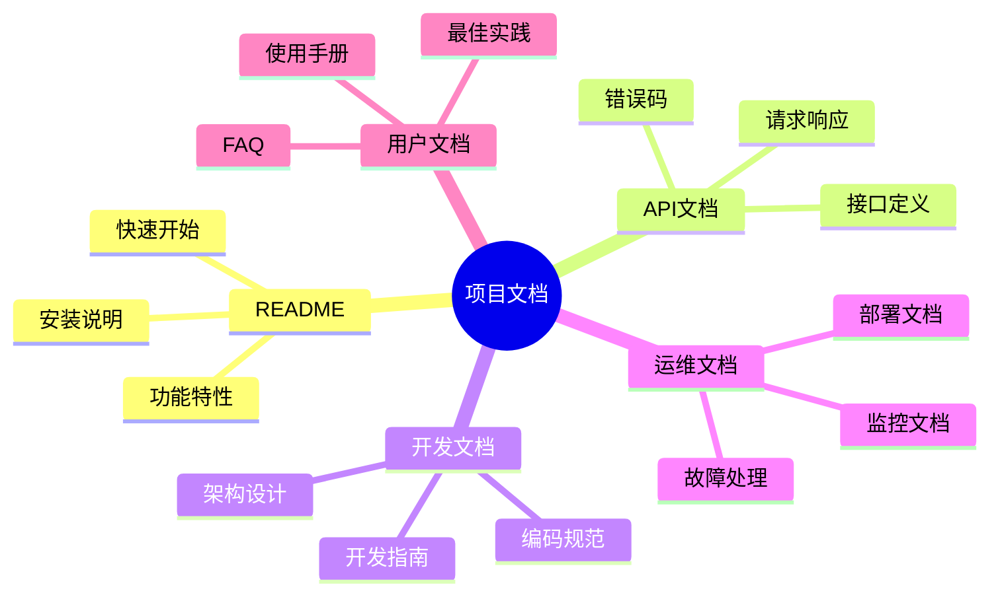
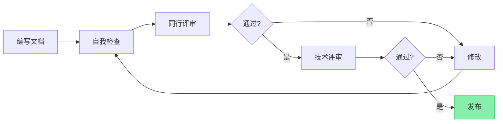

最近更新: 2025-10-11

# 文档体系与模板规范

> 完整的项目文档体系规范，涵盖README、API、CHANGELOG、部署等常用文档类型。

## 1. 文档体系概览

### 1.1 文档分类


### 1.2 文档优先级

| 文档类型 | 优先级 | 适用项目 | 更新频率 |
|---------|--------|----------|----------|
| **README.md** | P0 | 所有项目 | 每次重大变更 |
| **CHANGELOG.md** | P0 | 所有项目 | 每次发布 |
| **API.md** | P0 | 有API的项目 | 接口变更时 |
| **架构文档** | P1 | 中大型项目 | 每季度 |
| **部署文档** | P1 | 生产项目 | 部署方式变更时 |
| **用户手册** | P2 | ToC产品 | 功能变更时 |
| **FAQ** | P2 | 所有项目 | 按需 |

### 1.3 文档存放结构
```
项目根目录/
├── README.md                 # 项目主文档 ✅ 必需
├── CHANGELOG.md             # 变更日志 ✅ 必需
├── CONTRIBUTING.md          # 贡献指南
├── LICENSE                  # 许可证
├── docs/                    # 文档目录
│   ├── architecture/        # 架构文档
│   │   ├── README.md       # 架构文档索引
│   │   ├── architecture.md # 架构设计
│   │   └── adr/            # 架构决策记录
│   ├── api/                # API文档
│   │   ├── README.md
│   │   ├── user-api.md
│   │   └── order-api.md
│   ├── guides/             # 指南文档
│   │   ├── development.md  # 开发指南
│   │   ├── deployment.md   # 部署指南
│   │   └── contributing.md # 贡献指南
│   ├── user/               # 用户文档
│   │   ├── user-manual.md  # 用户手册
│   │   └── faq.md          # 常见问题
│   └── images/             # 文档图片
└── scripts/                # 脚本文件
```

---

## 2. README.md 规范

### 2.1 标准结构
```markdown
# 项目名称

<项目LOGO或Banner图片>

<项目简介：一句话说明项目是什么>

[](链接)
[](链接)
[](链接)

## ✨ 特性

- ✅ 核心特性1
- ✅ 核心特性2
- ✅ 核心特性3
- 🚧 开发中特性4

## 📦 快速开始

### 环境要求

- Node.js >= 16.0.0
- Python >= 3.8
- Docker >= 20.10

### 安装

```bash
# 克隆项目
git clone https://github.com/username/project.git

# 安装依赖
npm install  # 或 pip install -r requirements.txt

# 配置环境变量
cp .env.example .env
```

### 运行

```bash
# 开发模式
npm run dev

# 生产模式
npm run build
npm start
```

## 📖 文档

- [快速开始](./docs/guides/quickstart.md)
- [API 文档](./docs/api/)
- [架构设计](./docs/architecture/)
- [部署指南](./docs/guides/deployment.md)

## 🛠️ 技术栈

- **前端**: Vue 3 + TypeScript + Vite
- **后端**: Spring Boot + MySQL + Redis
- **部署**: Docker + Kubernetes

## 📁 项目结构

```
project/
├── src/              # 源代码
│   ├── api/          # API接口
│   ├── components/   # 组件
│   ├── services/     # 业务逻辑
│   └── utils/        # 工具函数
├── tests/            # 测试文件
├── docs/             # 文档
└── scripts/          # 脚本
```

## 🤝 贡献

欢迎贡献！请查看 [贡献指南](./CONTRIBUTING.md)

## 📄 许可证

[MIT License](./LICENSE)

## 👥 维护者

- [@username](https://github.com/username)

## 🙏 致谢

感谢所有贡献者！
```

### 2.2 README 检查清单
- [ ] 项目名称清晰
- [ ] 一句话描述项目用途
- [ ] 有状态徽章（构建、覆盖率等）
- [ ] 核心特性列表
- [ ] 环境要求明确
- [ ] 安装步骤可执行
- [ ] 运行示例可用
- [ ] 文档链接完整
- [ ] 技术栈说明
- [ ] 项目结构清楚
- [ ] 许可证信息
- [ ] 联系方式

### 2.3 README 最佳实践

**✅ 好的示例**：
```markdown
## 快速开始

### 安装
```bash
npm install my-package
```

### 使用
```javascript
import { myFunction } from 'my-package'

const result = myFunction({ name: 'example' })
console.log(result)
```

### 运行示例
```bash
node examples/basic.js
```

**❌ 不好的示例**：
```markdown
## 安装
安装依赖即可

## 使用
按照文档使用
```

---

## 3. CHANGELOG.md 规范

### 3.1 基于语义化版本
遵循 [Semantic Versioning 2.0.0](https://semver.org/lang/zh-CN/)：

- **主版本号（Major）**：不兼容的 API 修改
- **次版本号（Minor）**：向下兼容的功能性新增
- **修订号（Patch）**：向下兼容的问题修正

### 3.2 标准格式
```markdown
# Changelog

All notable changes to this project will be documented in this file.

The format is based on [Keep a Changelog](https://keepachangelog.com/zh-CN/1.0.0/),
and this project adheres to [Semantic Versioning](https://semver.org/lang/zh-CN/).

## [Unreleased]

### Added
- 新功能说明

### Changed
- 变更说明

### Deprecated
- 即将废弃的功能

### Removed
- 已移除的功能

### Fixed
- Bug修复说明

### Security
- 安全相关更新

## [1.2.0] - 2025-10-11

### Added
- 新增用户头像上传功能 (#123)
- 支持邮件通知系统 (#124)
- 新增数据导出功能 (#125)

### Changed
- 优化登录性能，响应时间从 500ms 降至 200ms (#126)
- 更新用户界面样式，提升可读性 (#127)

### Fixed
- 修复密码重置邮件发送失败的问题 (#128)
- 解决内存泄漏导致的服务重启问题 (#129)

## [1.1.0] - 2025-09-15

### Added
- 用户权限管理功能
- 数据批量导入导出

### Fixed
- 修复并发访问导致的数据不一致问题

## [1.0.0] - 2025-08-01

### Added
- 初始版本发布
- 用户注册登录功能
- 基础数据管理

[Unreleased]: https://github.com/user/repo/compare/v1.2.0...HEAD
[1.2.0]: https://github.com/user/repo/compare/v1.1.0...v1.2.0
[1.1.0]: https://github.com/user/repo/compare/v1.0.0...v1.1.0
[1.0.0]: https://github.com/user/repo/releases/tag/v1.0.0
```

### 3.3 变更类型说明
| 类型 | 说明 | 示例 |
|------|------|------|
| **Added** | 新增功能 | 新增用户搜索功能 |
| **Changed** | 功能变更 | 优化查询性能 |
| **Deprecated** | 即将废弃 | `oldAPI()` 将在 v2.0 移除 |
| **Removed** | 已移除功能 | 移除旧版本兼容代码 |
| **Fixed** | Bug修复 | 修复登录失败问题 |
| **Security** | 安全更新 | 修复 SQL 注入漏洞 |

### 3.4 自动化工具
- **Conventional Commits**: 基于提交信息自动生成
- **semantic-release**: 自动化版本发布
- **standard-version**: 版本管理和CHANGELOG生成

---

## 4. API 文档规范

### 4.1 接口文档模板
```markdown
# 用户管理 API

## 创建用户

创建新用户账号。

### 请求

**接口地址**: `POST /api/v1/users`

**认证方式**: 需要 Admin 权限

**请求头**:
```http
Content-Type: application/json
Authorization: Bearer <token>
```

**请求体**:
```json
{
  "username": "zhangsan",
  "email": "zhangsan@example.com",
  "password": "SecurePassword123!",
  "role": "user"
}
```

**字段说明**:
| 字段 | 类型 | 必填 | 说明 | 约束 |
|------|------|------|------|------|
| username | string | ✅ | 用户名 | 3-20字符，字母数字下划线 |
| email | string | ✅ | 邮箱 | 有效的邮箱格式 |
| password | string | ✅ | 密码 | 8-32字符，包含大小写字母数字特殊字符 |
| role | string | ❌ | 角色 | user/admin，默认 user |

### 响应

**成功响应** (201 Created):
```json
{
  "code": 200,
  "message": "创建成功",
  "data": {
    "id": 123,
    "username": "zhangsan",
    "email": "zhangsan@example.com",
    "role": "user",
    "createdAt": "2025-10-11T10:30:00Z"
  }
}
```

**错误响应** (400 Bad Request):
```json
{
  "code": 400,
  "message": "参数错误",
  "errors": [
    {
      "field": "email",
      "message": "邮箱格式不正确"
    }
  ]
}
```

### 状态码
| 状态码 | 说明 |
|--------|------|
| 201 | 创建成功 |
| 400 | 请求参数错误 |
| 401 | 未授权 |
| 403 | 无权限 |
| 409 | 用户已存在 |
| 500 | 服务器错误 |

### 示例代码

**cURL**:
```bash
curl -X POST https://api.example.com/api/v1/users \
  -H "Content-Type: application/json" \
  -H "Authorization: Bearer YOUR_TOKEN" \
  -d '{
    "username": "zhangsan",
    "email": "zhangsan@example.com",
    "password": "SecurePassword123!"
  }'
```

**JavaScript**:
```javascript
const response = await fetch('https://api.example.com/api/v1/users', {
  method: 'POST',
  headers: {
    'Content-Type': 'application/json',
    'Authorization': `Bearer ${token}`
  },
  body: JSON.stringify({
    username: 'zhangsan',
    email: 'zhangsan@example.com',
    password: 'SecurePassword123!'
  })
})

const data = await response.json()
console.log(data)
```

**Python**:
```python
import requests

response = requests.post(
    'https://api.example.com/api/v1/users',
    headers={
        'Content-Type': 'application/json',
        'Authorization': f'Bearer {token}'
    },
    json={
        'username': 'zhangsan',
        'email': 'zhangsan@example.com',
        'password': 'SecurePassword123!'
    }
)

data = response.json()
print(data)
```

### 注意事项
- ⚠️ 密码会被加密存储，不可逆
- ⚠️ 用户名和邮箱必须唯一
- ⚠️ 创建用户需要 Admin 权限
- ⚠️ API 有速率限制：100次/分钟
```

### 4.2 API 文档检查清单
- [ ] 接口路径准确
- [ ] HTTP 方法正确
- [ ] 认证方式说明
- [ ] 请求参数完整（类型、必填、约束）
- [ ] 响应格式统一
- [ ] 成功和错误响应都有示例
- [ ] 状态码说明清楚
- [ ] 提供多语言代码示例
- [ ] 注意事项和限制说明

### 4.3 API 文档工具
- **Swagger / OpenAPI**: 自动化API文档
- **Postman**: API测试和文档
- **Apidoc**: 从注释生成API文档
- **Docusaurus**: 文档站点生成器

---

## 5. 部署文档规范

### 5.1 部署文档模板
```markdown
# 部署指南

## 环境要求

### 服务器配置
- **CPU**: 4核心以上
- **内存**: 8GB以上
- **磁盘**: 50GB以上 SSD
- **操作系统**: Ubuntu 22.04 LTS 或 CentOS 7+
- **网络**: 公网IP，开放端口 80、443、22

### 软件依赖
| 软件 | 版本 | 安装方式 |
|------|------|----------|
| Docker | >= 20.10 | `curl -fsSL https://get.docker.com \| sh` |
| Docker Compose | >= 2.0 | 随Docker安装 |
| Nginx | >= 1.20 | `apt install nginx` |
| MySQL | >= 8.0 | Docker 容器 |

## 部署步骤

### 1. 准备服务器
```bash
# 更新系统
sudo apt update && sudo apt upgrade -y

# 安装 Docker
curl -fsSL https://get.docker.com | sh
sudo usermod -aG docker $USER

# 安装 Docker Compose
sudo curl -L "https://github.com/docker/compose/releases/latest/download/docker-compose-$(uname -s)-$(uname -m)" -o /usr/local/bin/docker-compose
sudo chmod +x /usr/local/bin/docker-compose
```

### 2. 克隆代码
```bash
git clone https://github.com/username/project.git
cd project
```

### 3. 配置环境变量
```bash
# 复制环境变量模板
cp .env.example .env

# 编辑配置文件
vim .env
```

**.env 配置说明**:
```bash
# 数据库配置
DB_HOST=localhost
DB_PORT=3306
DB_NAME=myapp
DB_USER=root
DB_PASSWORD=your_password  # ⚠️ 请修改为强密码

# Redis 配置
REDIS_HOST=localhost
REDIS_PORT=6379
REDIS_PASSWORD=your_password  # ⚠️ 请修改为强密码

# 应用配置
APP_PORT=8080
APP_ENV=production
APP_SECRET=your_secret_key  # ⚠️ 请修改为随机字符串

# JWT 配置
JWT_SECRET=your_jwt_secret  # ⚠️ 请修改为随机字符串
JWT_EXPIRE=7d
```

### 4. 启动服务
```bash
# 使用 Docker Compose 启动
docker-compose up -d

# 查看服务状态
docker-compose ps

# 查看日志
docker-compose logs -f
```

### 5. 初始化数据库
```bash
# 进入应用容器
docker-compose exec app bash

# 执行数据库迁移
npm run migrate

# 初始化数据
npm run seed
```

### 6. 配置 Nginx
```nginx
# /etc/nginx/sites-available/myapp
server {
    listen 80;
    server_name example.com;

    location / {
        proxy_pass http://localhost:8080;
        proxy_http_version 1.1;
        proxy_set_header Upgrade $http_upgrade;
        proxy_set_header Connection 'upgrade';
        proxy_set_header Host $host;
        proxy_cache_bypass $http_upgrade;
        proxy_set_header X-Real-IP $remote_addr;
        proxy_set_header X-Forwarded-For $proxy_add_x_forwarded_for;
    }
}
```

```bash
# 启用站点
sudo ln -s /etc/nginx/sites-available/myapp /etc/nginx/sites-enabled/
sudo nginx -t
sudo systemctl reload nginx
```

### 7. 配置 HTTPS（可选）
```bash
# 安装 Certbot
sudo apt install certbot python3-certbot-nginx

# 获取证书
sudo certbot --nginx -d example.com

# 自动续期
sudo certbot renew --dry-run
```

### 8. 验证部署
```bash
# 健康检查
curl http://localhost:8080/health

# 查看应用日志
docker-compose logs app

# 查看数据库连接
docker-compose exec db mysql -u root -p -e "SHOW DATABASES;"
```

## 监控和维护

### 日志查看
```bash
# 应用日志
docker-compose logs -f app

# Nginx 日志
tail -f /var/log/nginx/access.log
tail -f /var/log/nginx/error.log

# 系统日志
journalctl -u docker -f
```

### 备份
```bash
# 数据库备份
docker-compose exec db mysqldump -u root -p myapp > backup_$(date +%Y%m%d).sql

# 文件备份
tar -czf backup_$(date +%Y%m%d).tar.gz ./data
```

### 更新
```bash
# 拉取最新代码
git pull

# 重新构建并启动
docker-compose down
docker-compose build
docker-compose up -d

# 执行数据库迁移
docker-compose exec app npm run migrate
```

## 故障排查

### 常见问题

**1. 容器启动失败**
```bash
# 查看容器状态
docker-compose ps

# 查看容器日志
docker-compose logs app

# 检查配置文件
docker-compose config
```

**2. 数据库连接失败**
```bash
# 检查数据库容器
docker-compose exec db mysql -u root -p

# 检查网络连接
docker-compose exec app ping db
```

**3. 应用无响应**
```bash
# 检查端口占用
netstat -tlnp | grep 8080

# 重启服务
docker-compose restart app
```

## 性能优化

### 数据库优化
```sql
-- 添加索引
CREATE INDEX idx_user_email ON users(email);

-- 优化查询
EXPLAIN SELECT * FROM users WHERE email = 'test@example.com';
```

### 缓存配置
```bash
# Redis 配置
redis-cli CONFIG SET maxmemory 512mb
redis-cli CONFIG SET maxmemory-policy allkeys-lru
```

### Nginx 优化
```nginx
# 启用 Gzip 压缩
gzip on;
gzip_types text/plain text/css application/json application/javascript;

# 启用缓存
proxy_cache_path /var/cache/nginx levels=1:2 keys_zone=my_cache:10m inactive=60m;
```

## 安全加固

### 防火墙配置
```bash
# 允许必要端口
sudo ufw allow 22/tcp
sudo ufw allow 80/tcp
sudo ufw allow 443/tcp
sudo ufw enable
```

### 定期更新
```bash
# 更新系统
sudo apt update && sudo apt upgrade -y

# 更新 Docker 镜像
docker-compose pull
docker-compose up -d
```
```

### 5.2 部署文档检查清单
- [ ] 环境要求明确
- [ ] 软件依赖版本准确
- [ ] 部署步骤可执行
- [ ] 配置文件说明完整
- [ ] 安全注意事项标注
- [ ] 监控和日志方案
- [ ] 备份恢复流程
- [ ] 故障排查指南
- [ ] 性能优化建议

---

## 6. 用户手册规范

### 6.1 用户手册结构
```markdown
# 用户手册

## 1. 简介
### 1.1 产品概述
### 1.2 主要功能
### 1.3 适用人群

## 2. 快速开始
### 2.1 注册账号
### 2.2 登录系统
### 2.3 基本操作

## 3. 功能指南
### 3.1 用户管理
#### 3.1.1 创建用户
#### 3.1.2 编辑用户
#### 3.1.3 删除用户

### 3.2 数据管理
#### 3.2.1 导入数据
#### 3.2.2 导出数据
#### 3.2.3 批量操作

## 4. 高级功能
### 4.1 权限管理
### 4.2 自定义配置
### 4.3 API 集成

## 5. 常见问题
### 5.1 登录问题
### 5.2 数据问题
### 5.3 性能问题

## 6. 联系支持
### 6.1 在线客服
### 6.2 邮件支持
### 6.3 社区论坛
```

### 6.2 编写原则
- **用户视角**：站在用户角度，使用简单语言
- **图文并茂**：使用截图和视频辅助说明
- **步骤清晰**：操作步骤编号，逻辑清楚
- **突出重点**：重要内容使用高亮或提示框
- **实时更新**：功能变更及时更新文档

---

## 7. FAQ 文档规范

### 7.1 FAQ 格式
```markdown
# 常见问题（FAQ）

## 安装和配置

### Q: 如何安装项目？
**A**: 按照以下步骤安装：
1. 克隆仓库：`git clone https://github.com/user/repo.git`
2. 安装依赖：`npm install`
3. 启动项目：`npm start`

详细说明请查看 [安装指南](./installation.md)。

### Q: 配置文件在哪里？
**A**: 配置文件位于 `.env`，复制 `.env.example` 并修改：
```bash
cp .env.example .env
```

主要配置项说明：
- `DB_HOST`: 数据库地址
- `DB_PORT`: 数据库端口
- `APP_SECRET`: 应用密钥（必须修改）

## 使用问题

### Q: 如何创建用户？
**A**: 有两种方式：
1. **通过界面**：进入用户管理 → 点击"新建用户" → 填写信息 → 保存
2. **通过API**：发送 POST 请求到 `/api/users`

代码示例：
```javascript
const response = await fetch('/api/users', {
  method: 'POST',
  body: JSON.stringify({ username: 'test', email: 'test@example.com' })
})
```

### Q: 忘记密码怎么办？
**A**: 
1. 点击登录页面的"忘记密码"
2. 输入注册邮箱
3. 查收重置密码邮件
4. 点击邮件中的链接设置新密码

⚠️ **注意**：重置链接有效期为 24 小时。

## 错误排查

### Q: 出现"Connection refused"错误？
**A**: 这通常是数据库连接问题，检查：
1. 数据库服务是否启动：`docker-compose ps`
2. 数据库配置是否正确：检查 `.env` 文件
3. 网络是否可达：`ping localhost`

如果问题仍未解决，查看 [故障排查指南](./troubleshooting.md)。

### Q: 页面加载很慢？
**A**: 可能原因：
1. **网络问题**：检查网络连接
2. **服务器负载高**：查看服务器资源使用情况
3. **缓存未启用**：检查 Redis 是否正常运行

优化建议：
- 启用浏览器缓存
- 使用 CDN 加速静态资源
- 优化数据库查询

## 其他问题

### Q: 如何贡献代码？
**A**: 请查看 [贡献指南](./CONTRIBUTING.md)

### Q: 如何报告Bug？
**A**: 在 [GitHub Issues](https://github.com/user/repo/issues) 创建问题，请包含：
- 问题描述
- 复现步骤
- 期望行为
- 实际行为
- 环境信息（系统、版本等）

### Q: 如何联系我们？
**A**:
- **GitHub Issues**: [提交问题](https://github.com/user/repo/issues)
- **邮件**: support@example.com
- **Discord**: [加入社区](https://discord.gg/xxx)
```

### 7.2 FAQ 编写技巧
- **分类整理**：按主题分组（安装、使用、故障等）
- **搜索友好**：使用清晰的问题标题
- **提供链接**：引用详细文档
- **定期更新**：根据用户反馈更新
- **数据驱动**：优先解答高频问题

---

## 8. 文档质量检查

### 8.1 文档质量标准
| 维度 | 标准 | 检查方法 |
|------|------|----------|
| **准确性** | 内容无误，可执行 | 人工验证 |
| **完整性** | 覆盖所有功能 | 对照功能清单 |
| **可读性** | 语言流畅，结构清晰 | 同行评审 |
| **时效性** | 与代码同步 | 版本对比 |
| **可用性** | 用户能快速找到答案 | 用户反馈 |

### 8.2 文档检查清单
**内容检查**：
- [ ] 信息准确，无错误
- [ ] 步骤完整，可执行
- [ ] 代码示例可运行
- [ ] 链接有效
- [ ] 图片清晰

**格式检查**：
- [ ] Markdown 语法正确
- [ ] 标题层级合理
- [ ] 代码块有语言标识
- [ ] 表格格式规范
- [ ] 列表缩进正确

**语言检查**：
- [ ] 术语统一
- [ ] 无错别字
- [ ] 语言流畅
- [ ] 避免歧义
- [ ] 符合规范

### 8.3 文档审查流程


---

## 9. 文档维护

### 9.1 更新时机
- **功能变更**：API变更、功能增删
- **Bug修复**：涉及文档的Bug修复
- **用户反馈**：用户反馈文档问题
- **定期审查**：每季度全面审查

### 9.2 版本管理
```markdown
## 变更记录
| 日期 | 版本 | 变更内容 | 变更人 |
|------|------|----------|--------|
| 2025-10-11 | 2.0 | 重构文档结构 | 张三 |
| 2025-09-15 | 1.5 | 新增API文档 | 李四 |
| 2025-08-01 | 1.0 | 初始版本 | 王五 |
```

### 9.3 文档废弃
对于废弃的文档，不要直接删除，而是：
1. 在文档顶部标注 `⚠️ 已废弃`
2. 说明废弃原因
3. 提供替代文档链接
4. 设置废弃期（如6个月后删除）

```markdown
> ⚠️ **已废弃**
> 
> 本文档已于 2025-10-11 废弃，将于 2026-04-11 删除。
> 
> 请查看新版文档：[新版部署指南](./deployment-v2.md)
```

---

## 10. 文档工具推荐

### 10.1 文档生成工具
| 工具 | 类型 | 适用场景 |
|------|------|----------|
| **VuePress** | 静态站点 | Vue 项目文档 |
| **Docusaurus** | 静态站点 | React 项目文档 |
| **MkDocs** | 静态站点 | Python 项目文档 |
| **Swagger** | API 文档 | RESTful API |
| **JSDoc** | API 文档 | JavaScript 项目 |
| **Sphinx** | API 文档 | Python 项目 |

### 10.2 图表工具
- **Mermaid**: Markdown 中绘图
- **Draw.io**: 在线流程图工具
- **PlantUML**: UML 图表
- **Excalidraw**: 手绘风格图表

### 10.3 协作工具
- **Notion**: 团队协作文档
- **Confluence**: 企业级文档系统
- **GitBook**: 在线文档平台
- **Read the Docs**: 开源项目文档托管

---

## 11. 与其他规约的关系

- **架构文档**: 参考 `architecture-lightweight.md`、`module-design-guidelines.md`
- **ADR 文档**: 遵循 `adr-template.md`
- **功能规格**: 参考 `feature-specification-guidelines.md`
- **编码规范**: 文档中的代码示例遵循 `coding-standards.md`

---

**重要提示**：好的文档是项目成功的关键。文档应该是活的、可维护的，而不是写完就忘的"遗产代码"！
