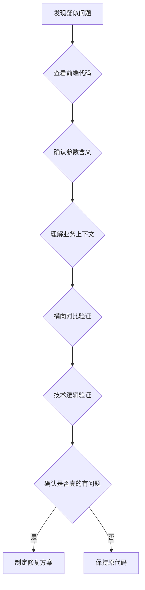

# 代码分析经验教训案例集

> 记录实际项目中的代码分析误判案例，作为规范的补充说明

## 案例1：ActivityServiceImpl 分析误判（2026-01-06）

### 背景
用户报告了3个"严重功能问题"，经过深入分析和多轮验证，发现**所有判断都是错误的**，原代码完全正确。

### 误判过程

#### 误判1：跳转类型映射错误

**初始判断**：
```java
// 认为映射关系错误
if (jumpType == 1) {
    jumpTypeS = "H5";  // 认为应该是"小程序"
}
```

**验证过程**：
- 查看前端小程序代码
- 发现 `if(item.jumpType == 1)` 跳转到 webview（H5）

**结论**：原代码正确（1=H5, 2=小程序, 3=H5+小程序）

**教训**：
- ❌ 不能仅凭后端代码判断业务逻辑
- ✅ 必须查看前端实际使用代码

---

#### 误判2：Sort 字段不能为负数

**初始判断**：
```java
// 认为需要添加负数检查
if (sort < 0) {
    sort = 0;  // 修正为0
}
```

**用户质疑**："sort为什么不能为负数？"

**重新分析**：
1. 数据类型：`Integer` 可以存储负数
2. 排序逻辑：`ORDER BY sort ASC` 对负数有效（-2 < -1 < 0 < 1）
3. 置顶操作：`sort = minSort - 1`，允许负数是合理的

**示例**：
```
活动A: sort=1 → 置顶 → sort=0
活动B: sort=0 → 置顶 → sort=-1 ✅ 正常！
活动C: sort=-1 → 置顶 → sort=-2 ✅ 继续有效！
```

**结论**：Sort 可以为负数，原代码正确

**教训**：
- ❌ 不要过度假设业务规则
- ✅ 必须理解技术实现的合理性
- ✅ 质疑很重要："为什么"比"是什么"更重要

---

#### 误判3：分页逻辑错误

**初始判断**：
```java
// 认为这是错误的
.skip((long) request.getPageIndex() * request.getPageSize())

// 认为应该改为
.skip((long) (request.getPageIndex() - 1) * request.getPageSize())
```

**第一轮验证**：
- 对比项目中其他分页实现
- 发现 WithdrawalServiceImpl 使用 `(page - 1) * pageSize`
- 得出结论：应该修改

**用户质疑**："pageIndex是从0开始的"

**第二轮验证**：
```typescript
// 查看前端小程序代码
let HotelStartPageIndex = 0;  // 从0开始！

original_params: {
  page: HotelStartPageIndex, //页码 = 0
  pageSize: HotelPageSize,
}
```

**分页公式验证**：
```
如果 pageIndex 从 0 开始：
- 第1页：pageIndex=0, skip = 0 * 10 = 0 ✅
- 第2页：pageIndex=1, skip = 1 * 10 = 10 ✅

如果改为 (pageIndex - 1) * pageSize：
- 第1页：pageIndex=0, skip = -1 * 10 = -10 ❌ 错误！
```

**关键发现**：项目中存在两种分页模式
```
管理后台接口：pageIndex 从 1 开始 → (pageIndex - 1) * pageSize
小程序活动接口：pageIndex 从 0 开始 → pageIndex * pageSize
```

**结论**：原代码正确，不同接口服务于不同客户端

**教训**：
- ❌ 不能假设所有接口使用相同的规则
- ❌ 横向对比时必须确认是否服务于相同的客户端
- ✅ 必须查看前端实际传值
- ✅ 理解不同客户端可能有不同的约定

---

### 总结

#### 问题根源
1. **缺乏前后端一致性验证**：仅看后端代码就下结论
2. **过度假设业务规则**：认为 sort 不能为负数
3. **横向对比不当**：对比了不同客户端的接口实现

#### 正确的分析流程



#### 核心原则

1. **充分验证再判断**
   - 前后端一致性
   - 业务上下文
   - 横向对比（注意上下文）
   - 技术逻辑

2. **不要过度修复**
   - 如果代码能正常工作，可能它就是对的
   - 理解业务上下文比修改代码更重要

3. **鼓励质疑**
   - 用户的质疑往往能发现分析中的盲点
   - "为什么"比"是什么"更重要

4. **保持谦虚**
   - 承认可能存在误判
   - 及时纠正错误的分析

---

## 经验教训清单

### 分析前（必须完成）
- [ ] 理解用户报告的问题背景
- [ ] 查看相关的业务文档
- [ ] 了解系统的整体架构

### 判断问题时（必须验证）
- [ ] 查看前端实际调用代码
- [ ] 确认参数的实际含义和取值范围
- [ ] 验证前后端的约定
- [ ] 检查不同客户端是否有不同的约定
- [ ] 理解为什么代码这样写
- [ ] 对比项目中其他类似功能（注意上下文）
- [ ] 验证技术逻辑的合理性

### 提出修复方案前（必须评估）
- [ ] 确认问题真实存在（有明确的bug复现）
- [ ] 理解问题的根本原因
- [ ] 评估修复的影响范围
- [ ] 制定回归测试计划
- [ ] 准备回滚方案

### 修复后（必须验证）
- [ ] 验证修复的正确性
- [ ] 确认没有引入新问题
- [ ] 更新相关文档
- [ ] 记录经验教训

---

## 典型误判模式

### 模式1：仅看后端代码判断
```
❌ 看到后端代码 → 认为有问题 → 直接修改
✅ 看到后端代码 → 查看前端调用 → 理解完整交互 → 判断
```

### 模式2：过度假设业务规则
```
❌ 认为字段不能为负数 → 添加边界检查
✅ 分析数据类型 → 理解业务逻辑 → 验证是否合理
```

### 模式3：横向对比不当
```
❌ 看到其他接口的实现 → 认为应该统一 → 修改
✅ 看到其他接口的实现 → 确认是否相同场景 → 理解差异原因
```

### 模式4：忽视用户质疑
```
❌ 用户质疑 → 坚持自己的判断 → 引入错误
✅ 用户质疑 → 重新验证 → 发现误判 → 纠正
```

---

## 参考规范

- 详细规范：`.qoder/rules/tools/code-analysis.md` 第6节
- 基本原则：`.qoder/rules/tools/must.md` 第6节

---

**更新日期**：2026-01-06  
**案例来源**：ActivityServiceImpl 分析误判事件  
**文档维护**：持续更新，记录新的经验教训

